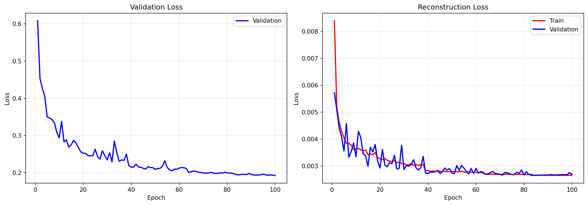
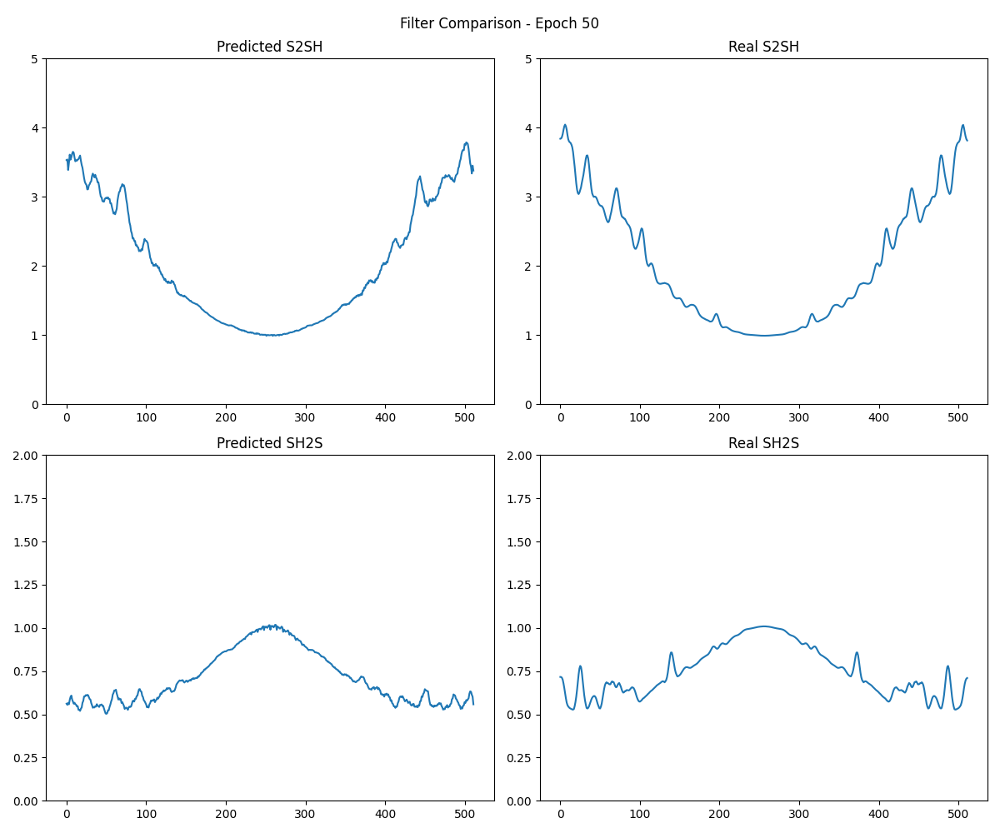
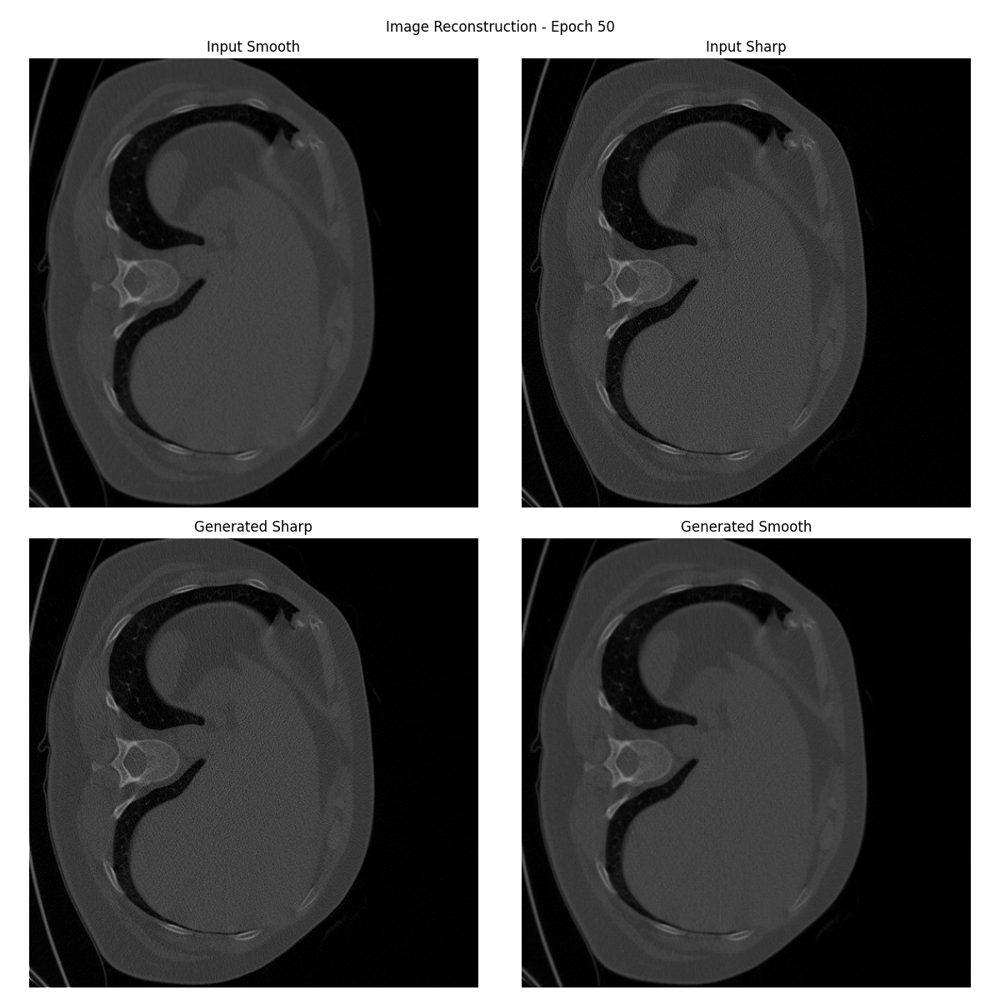

# FilterEstimator

A deep learning model for estimating frequency domain filters to convert between CT reconstruction kernels. The model learns to predict filter transfer functions from paired smooth/sharp CT images, enabling kernel conversion in the frequency domain.

## Overview

CT images are reconstructed using different kernels (smooth vs sharp), which affect the texture and noise characteristics. This project trains a neural network to estimate the frequency-domain filter ratios between kernel pairs, allowing conversion between smooth and sharp reconstructions.

### Key Features

- **Bidirectional Conversion**: Predicts filters for both smooth-to-sharp (S2SH) and sharp-to-smooth (SH2S) conversions
- **PSD-Based Input**: Uses Power Spectral Density (PSD) representations of image pairs
- **Frequency Domain Processing**: Applies learned filters in the Fourier domain for efficient kernel conversion

## Architecture

The `FilterEstimator` model is a U-Net style encoder-decoder network:

```
Input: [smooth_psd, sharp_psd] -> [B, 2, 512, 512]

Encoder:
  Conv2d (2 -> 32) + ResBlock -> 256x256
  Conv2d (32 -> 64) + ResBlock -> 128x128
  Conv2d (64 -> 128) + ResBlock -> 64x64

Decoder:
  ConvTranspose2d (128 -> 64) + ResBlock -> 128x128
  ConvTranspose2d (64 -> 32) + ResBlock -> 256x256
  ConvTranspose2d (32 -> 32) + Conv2d -> 512x512

Output: filter_s2sh [B, 512, 512], filter_sh2s [B, 512, 512]
```

**Components**:
- ResBlock2D with Instance Normalization and LeakyReLU
- Learnable filter strength parameter
- Softplus activation for positive filter values (min 0.1)

## Training

### Loss Functions

The model is trained with a combination of:
1. **Filter Loss (L1)**: Compares predicted filters to ground truth filters computed from FFT ratios
2. **Reconstruction Loss (L1)**: Compares generated images to target images after applying predicted filters

### Training Configuration

- Optimizer: Adam (lr=1e-4)
- Scheduler: ReduceLROnPlateau (factor=0.5, patience=5)
- Batch Size: 8
- Epochs: 100
- Mixed Precision: bfloat16 (CUDA)

### Training Progress

| Metric | Initial (Epoch 1) | Final (Epoch 100) |
|--------|-------------------|-------------------|
| Train Total Loss | 25.41 | 24.52 |
| Train Filter Loss | 25.40 | 24.52 |
| Train Recon Loss | 0.0084 | 0.0027 |
| Val Total Loss | 0.608 | 0.193 |
| Val Filter Loss | 0.603 | 0.190 |
| Val Recon Loss | 0.0057 | 0.0027 |

### Loss Curves



*Training progress over 100 epochs. Left: Validation total loss showing steady convergence. Right: Reconstruction loss for both training and validation sets.*

## Results

### Filter Comparison

The model learns to predict smooth filter profiles that match the ground truth frequency response:



*Comparison of predicted vs real filter profiles at epoch 50. Top row: Smooth-to-Sharp (S2SH) filters. Bottom row: Sharp-to-Smooth (SH2S) filters.*

### Image Reconstruction

Generated images closely match the target reconstructions:



*Image reconstruction results at epoch 50. Top: Input smooth and sharp images. Bottom: Generated sharp and smooth images using predicted filters.*

## Project Structure

```
FilterEstimator/
├── FilterModel.py          # Model architecture (FilterEstimator, ResBlock2D)
├── TrainFilter.py          # Training script with visualization
├── reconstruct_filter.py   # Inference script for volume reconstruction
├── TestDataset.py          # Dataset loader for test volumes
├── training_filter_model/
│   ├── checkpoints/        # Model checkpoints (epoch_*.pth, best.pth)
│   ├── visualization/      # Training visualizations
│   │   ├── filter_epoch_*.png
│   │   └── images_epoch_*.png
│   └── metrics.json        # Training/validation metrics
├── testA/                  # Test data (smooth kernel)
└── testB/                  # Test data (sharp kernel)
```

## Usage

### Training

```python
python TrainFilter.py
```

Checkpoints and visualizations are saved to `training_filter_model/`.

### Inference

```python
from FilterModel import FilterEstimator
from reconstruct_filter import load_model, reconstruct_volume

# Load trained model
model = load_model("training_filter_model/checkpoints/best.pth")

# Reconstruct volume
reconstruct_volume(sample, model, output_dir, save_filters=True)
```

### Output

The reconstruction script generates:
- Converted NIfTI volumes (`.nii.gz`)
- Filter profiles (`.npy`)
- Filter visualization plots (`.png`)

## Requirements

- Python 3.10+
- PyTorch
- NumPy
- Nibabel (for NIfTI I/O)
- Matplotlib
- tqdm

## License

This project is for research purposes.
